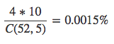
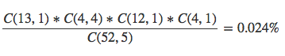

# 17 Pokers

在 [Liar Game S2E2](./LiarGameS2E3.jpg) 後半的一個遊戲 17 Pokers，
17張牌共有 6188 種組合 C(17,5)
[rule screenshot](./17poker_rule.png)

有八種牌型分別是
4 Aces, 4 Kings, 4 Queens, 4 Jacks and a Joker
joker card is wild card

有些名詞可參考：
[Non-standard poker hand at wiki](https://en.wikipedia.org/wiki/Non-standard_poker_hand)

在此遊戲中，至少會有 1pair 可拿，
第三欄機率為鬼牌不作用，第四欄機率為
鬼牌有提升 1pair 提升為 3cards，
以及將 2pair 提升為 full house，的出現機率。
下表為各牌型出現的機率為 (百分比)：

| No |   Name      | Probability | Prob. (Joker) | Comment |
|:--:|:----------------|------------:|----------:|:--------|
| 1  | five-of-a-kind  |   0.0646% |  0.0646%  | 4 cards w/ joker |
| 2  | royal flush     |   0.0646% |  0.0646%  | royal straight flush |
| 3  | four-of-a-kind  |   0.7757% |  0.7757%  | 4 cards no joker |
| 4  | full house      |   4.6542% |  8.1448%  | three-of-a-kind w/ 1 pair |
| 5  | straight        |   4.0724% |  4.0724%  | straight (joker) |
| 6  | three-of-a-kind |  15.5139% |  34.1306% | 3 cards |
| 7  | 2 pairs         |  31.4156% |  27.9250% | 2 pairs |
| 8  | 1 pair          |  43.4389% |  24.8222% | 1 pairs |
| -  | total           | 100.0000% | 100.0000% ||

### files

- 17poker.py: init deck and deal 5 cards to 4 players
- cmb.py: list all combinations for C(17,5)
    - all-cmb.txt: generated by cmb.py (line ending: LFCR)
- fisher_yates_shuffle.py: provide shuffle function
- num-to-desk.pl: to determine what type of cards


### Some notes ###

完整52張牌：
```
P(52, 5) = 311,875,200
C(52, 5) = 2,598,960
```

* straight flush
  all same suit

  

    Steel Wheel:
    ```
    5♦ 4♦ 3♦ 2♦ A♦
    ```

    An ace-high straight flush such as
    ```
    A♦ K♦ Q♦ J♦ 10♦
    ```
    is known as a _royal flush_ or *total 4 _royal flush_*

* four of a kind

  


- other name of poker hand:
  - full house
  - flush
  - straight
  - high card

### reference
- http://blog.yam.com/mehome0619/article/28938038
- http://en.wikipedia.org/wiki/In_shuffle
- http://en.wikipedia.org/wiki/Faro_shuffle
- http://en.wikipedia.org/wiki/List_of_poker_hands
